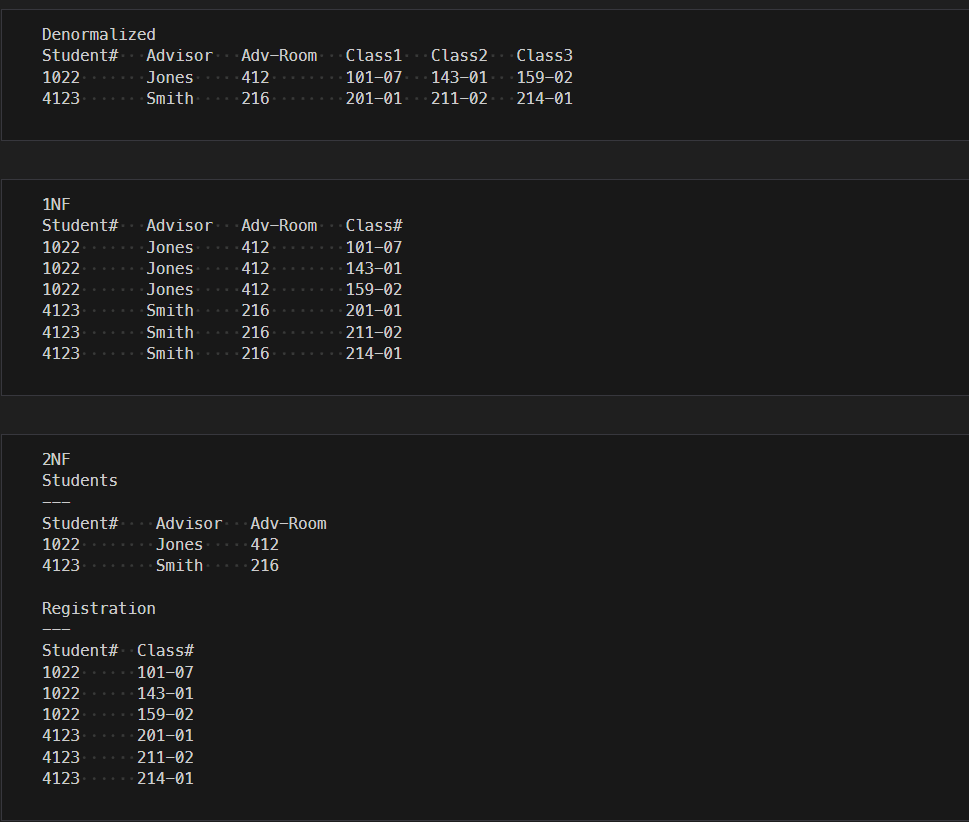
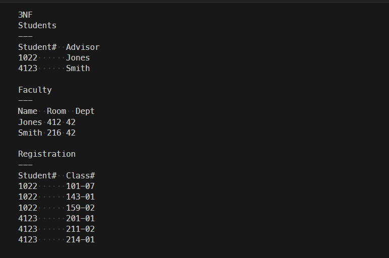
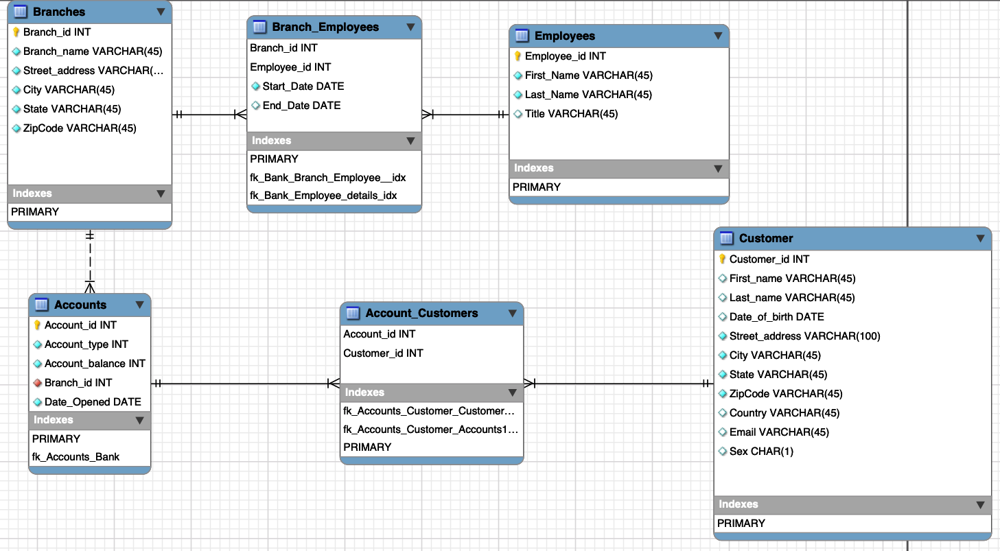

# Modeling and Designing Databases

## An Amateur Approach

    +------------+---------+-----------------------+------+
    | GivenNames | Surname | CourseName            | Pctg |
    +------------+---------+-----------------------+------+
    | John Paul  | Bloggs  | Data Science          |   72 |
    | Sarah      | Doe     | Programming 1         |   87 |
    | John Paul  | Bloggs  | Computing Mathematics |   43 |
    | John Paul  | Bloggs  | Computing Mathematics |   65 |
    | Sarah      | Doe     | Data Science          |   65 |
    | Susan      | Smith   | Computing Mathematics |   75 |
    | Susan      | Smith   | Programming 1         |   55 |
    | Susan      | Smith   | Computing Mathematics |   80 |
    +------------+---------+-----------------------+------+

> Which Susan is which?

    +------------+------------+---------+-----------------------+------+
    | StudentID  | GivenNames | Surname | CourseName            | Pctg |
    +------------+------------+---------+-----------------------+------+
    | 12345678   | John Paul  | Bloggs  | Data Science          |   72 |
    | 12345121   | Sarah      | Doe     | Programming 1         |   87 |
    | 12345678   | John Paul  | Bloggs  | Computing Mathematics |   43 |
    | 12345678   | John Paul  | Bloggs  | Computing Mathematics |   65 |
    | 12345121   | Sarah      | Doe     | Data Science          |   65 |
    | 12345876   | Susan      | Smith   | Computing Mathematics |   75 |
    | 12345876   | Susan      | Smith   | Programming 1         |   55 |
    | 12345303   | Susan      | Smith   | Computing Mathematics |   80 |
    +------------+------------+---------+-----------------------+------+

> Did John Paul pass or fail?

    +------------+------------+---------+-----------------------+------+-----+------+
    | StudentID  | GivenNames | Surname | CourseName            | Year | Sem | Pctg |
    +------------+------------+---------+-----------------------+------+-----+------+
    | 12345678   | John Paul  | Bloggs  | Data Science          | 2019 |   2 |   72 |
    | 12345121   | Sarah      | Doe     | Programming 1         | 2020 |   1 |   87 |
    | 12345678   | John Paul  | Bloggs  | Computing Mathematics | 2019 |   2 |   43 |
    | 12345678   | John Paul  | Bloggs  | Computing Mathematics | 2020 |   1 |   65 |
    | 12345121   | Sarah      | Doe     | Data Science          | 2020 |   1 |   65 |
    | 12345876   | Susan      | Smith   | Computing Mathematics | 2019 |   1 |   75 |
    | 12345876   | Susan      | Smith   | Programming 1         | 2019 |   2 |   55 |
    | 12345303   | Susan      | Smith   | Computing Mathematics | 2020 |   1 |   80 |
    +------------+------------+---------+-----------------------+------+-----+------+

> can I infer one column from another?

    Student_Details
    +------------+------------+---------+
    | StudentID  | GivenNames | Surname |
    +------------+------------+---------+
    | 12345121   | Sarah      | Doe     |
    | 12345303   | Susan      | Smith   |
    | 12345678   | John Paul  | Bloggs  |
    | 12345876   | Susan      | Smith   |
    +------------+------------+---------+

    Student_Details
    +------------+-----------------------+------+-----+------+
    | StudentID  | CourseName            | Year | Sem | Pctg |
    +------------+-----------------------+------+-----+------+
    | 12345678   | Data Science          | 2019 |   2 |   72 |
    | 12345121   | Programming 1         | 2020 |   1 |   87 |
    | 12345678   | Computing Mathematics | 2019 |   2 |   43 |
    | 12345678   | Computing Mathematics | 2020 |   1 |   65 |
    | 12345121   | Data Science          | 2020 |   1 |   65 |
    | 12345876   | Computing Mathematics | 2019 |   1 |   75 |
    | 12345876   | Programming 1         | 2019 |   2 |   55 |
    | 12345303   | Computing Mathematics | 2020 |   1 |   80 |
    +------------+-----------------------+------+-----+------+

> Should we keep information on a student’s enrollment date, postal and email addresses, fees, or attendance? Should we store different types of postal addresses?

## The Database Design Process

-   *Requirements analysis*
-   *Conceptual design*
-   *Logical design*

## The Entity Relationship Model

At a basic level, databases store information about distinct objects, or entities, and the associations, or relationships, between these entities
A popular approach to conceptual design uses the Entity Relationship (ER) model

# Database Normalization

**The first normal form (1NF) has the following goals**

-   Eliminate repeating groups in individual tables.
-   Create a separate table for each set of related data.
-   Identify each set of related data with a primary key.

**The goals of second normal form (2NF) are**

-   Create separate tables for sets of values that apply to multiple
    records.
-   Relate these tables with a foreign key.

**Third normal form (3NF) adds one more goal**

-   Eliminate fields that do not depend on the key.

### Entity Relationship Modeling Examples

