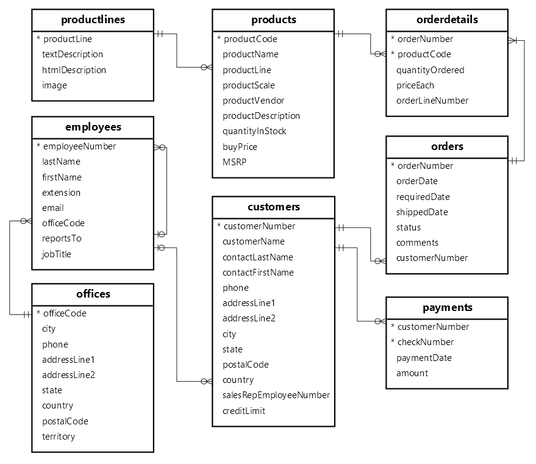

# Clasicmodels-db A MySQL Sample Database Schema
The MySQL sample database schema consists of the following tables:
- **customers:** stores customer’s data.
- **products:** stores a list of scale model cars.
- **productlines:** stores a list of product lines.
- **orders:** stores sales orders placed by customers.
- **orderdetails:** stores sales order line items for every sales order.
- **payments:** stores payments made by customers based on their accounts.
- **employees:** stores employee information and the organization structure such as who reports to whom.
- **offices:** stores sales office data.

The following picture illustrates the ER diagram of the sample , You can check [this pdf](https://www.mysqltutorial.org/wp-content/uploads/2018/04/MySQL-Sample-Database-Diagram-PDF-A4.pdf) too

 ## Tables

 - [ ] Table name: **customers**
    | Columns                | Data Type (Size) | Null | Keys |
    |------------------------|------------------|------|------|
    | customerNumber         | int              | NO   | PRI  |
    | customerName           | varchar(50)      | NO   |      |
    | contactLastName        | varchar(50)      | NO   |      |
    | contactFirstName       | varchar(50)      | NO   |      |
    | phone                  | varchar(50)      | NO   |      |
    | addressLine1           | varchar(50)      | NO   |      |
    | addressLine2           | varchar(50)      | YES  |      |
    | city                   | varchar(50)      | NO   |      |
    | state                  | varchar(50)      | YES  |      |
    | postalCode             | varchar(15)      | YES  |      |
    | country                | varchar(50)      | NO   |      |
    | salesRepEmployeeNumber | int              | YES  | MUL  |
    | creditLimit            | decimal(10,2)    | YES  |      |
 - [ ] Table name: **employees**
    | Columns                | Data Type (Size) | Null | Keys |
    |------------------------|------------------|------|------|
    | employeeNumber         | int              | NO   | PRI  |
    | lastName               | varchar(50)      | NO   |      |
    | firstName              | varchar(50)      | NO   |      |
    | extension              | varchar(10)      | NO   |      |
    | email                  | varchar(100)     | NO   |      |
    | officeCode             | varchar(10)      | NO   | MUL  |
    | reportsTo              | int              | YES  | MUL  |
    | jobTitle               | varchar(50)      | NO   |      |
 - [ ] Table name: **offices**
    | Columns                | Data Type (Size) | Null | Keys |
    |------------------------|------------------|------|------|
    | officeCode             | varchar(10)      | NO   | PRI  |
    | city                   | varchar(50)      | NO   |      |
    | phone                  | varchar(50)      | NO   |      |
    | addressLine1           | varchar(50)      | NO   |      |
    | addressLine2           | varchar(50)      | YES  |      |
    | state                  | varchar(50)      | YES  |      |
    | country                | varchar(50)      | NO   |      |
    | postalCode             | varchar(15)      | NO   |      |
    | territory              | varchar(10)      | NO   |      |
 - [ ] Table name: **orderdetails**
    | Columns                | Data Type (Size) | Null | Keys |
    |------------------------|------------------|------|------|
    | orderNumber            | int              | NO   | PRI  |
    | productCode            | varchar(15)      | NO   | PRI  |
    | quantityOrdered        | int              | NO   |      |
    | priceEach              | decimal(10,2)    | NO   |      |
    | orderLineNumber        | smallint         | NO   |      |
 - [ ] Table name: **orders**
    | Columns                | Data Type (Size) | Null | Keys |
    |------------------------|------------------|------|------|
    | orderNumber            | int              | NO   | PRI  |
    | orderDate              | date             | NO   |      |
    | requiredDate           | date             | NO   |      |
    | shippedDate            | date             | YES  |      |
    | status                 | varchar(15)      | NO   |      |
    | comments               | text             | YES  |      |
    | customerNumber         | int              | NO   | MUL  |
 - [ ] Table name: **payments**
    | Columns                | Data Type (Size) | Null | Keys |
    |------------------------|------------------|------|------|
    | customerNumber         | int              | NO   | PRI  |
    | checkNumber            | varchar(50)      | NO   | PRI  |
    | paymentDate            | date             | NO   |      |
    | amount                 | decimal(10,2)    | NO   |      |
 - [ ] Table name: **productlines**
    | Columns                | Data Type (Size) | Null | Keys |
    |------------------------|------------------|------|------|
    | productLine            | varchar(50)      | NO   | PRI  |
    | textDescription        | varchar(4000)    | YES  |      |
    | htmlDescription        | mediumtext       | YES  |      |
    | image                  | mediumblob       | YES  |      |
 - [ ] Table name: **products**
    | Columns                | Data Type (Size) | Null | Keys |
    |------------------------|------------------|------|------|
    | productCode            | varchar(15)      | NO   | PRI  |
    | productName            | varchar(70)      | NO   |      |
    | productLine            | varchar(50)      | NO   | MUL  |
    | productScale           | varchar(10)      | NO   |      |
    | productVendor          | varchar(50)      | NO   |      |
    | productDescription     | text             | NO   |      |
    | quantityInStock        | smallint         | NO   |      |
    | buyPrice               | decimal(10,2)    | NO   |      |
    | MSRP                   | decimal(10,2)    | NO   |      |

